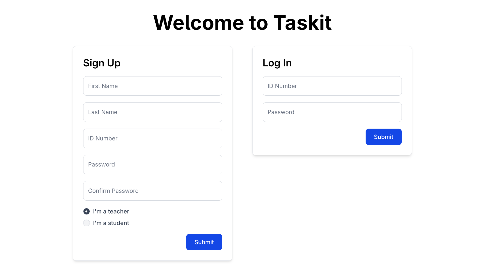
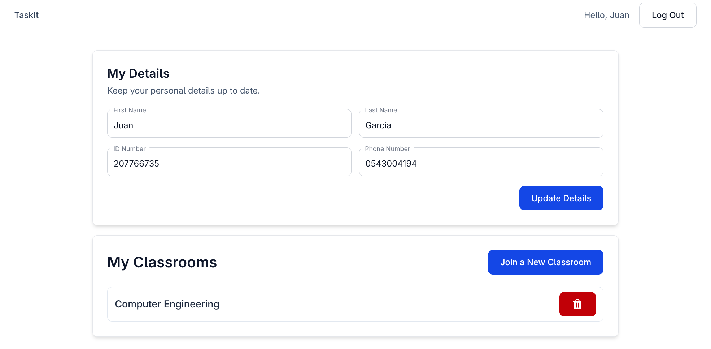
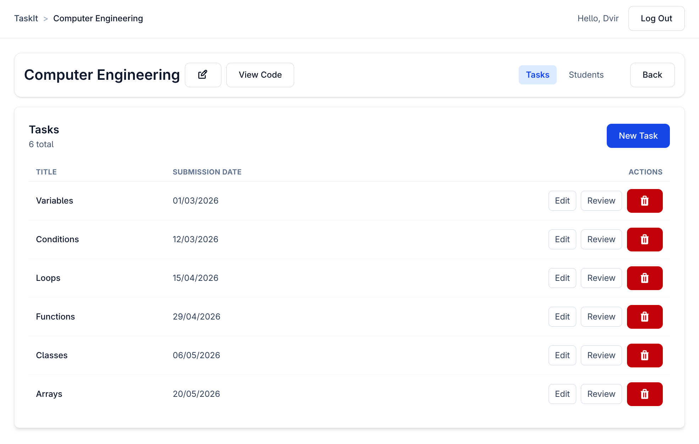
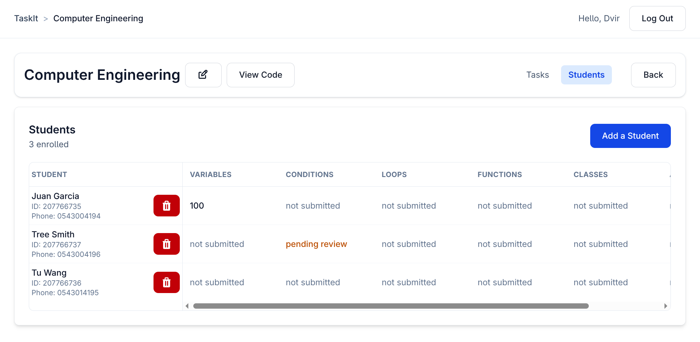
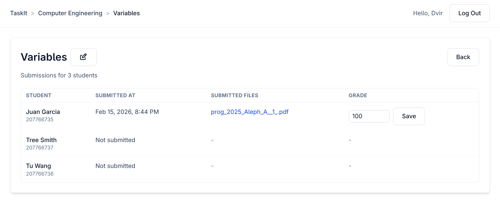
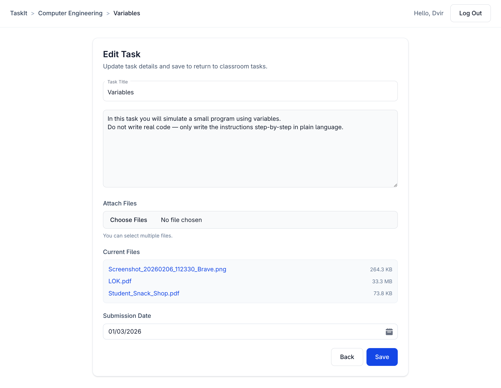
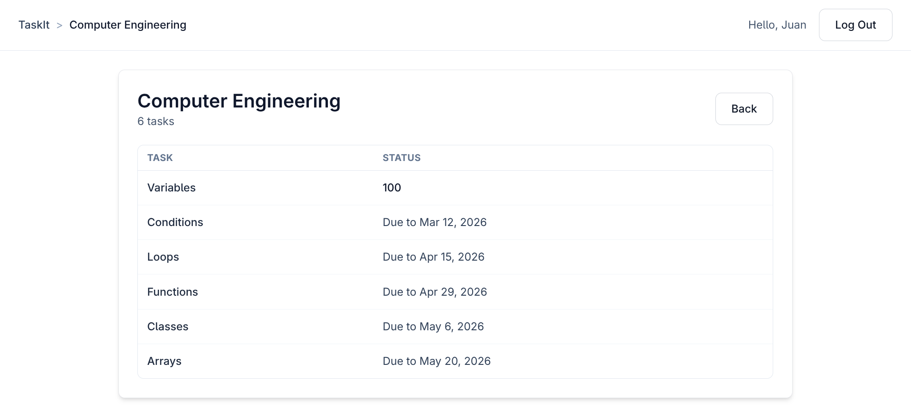
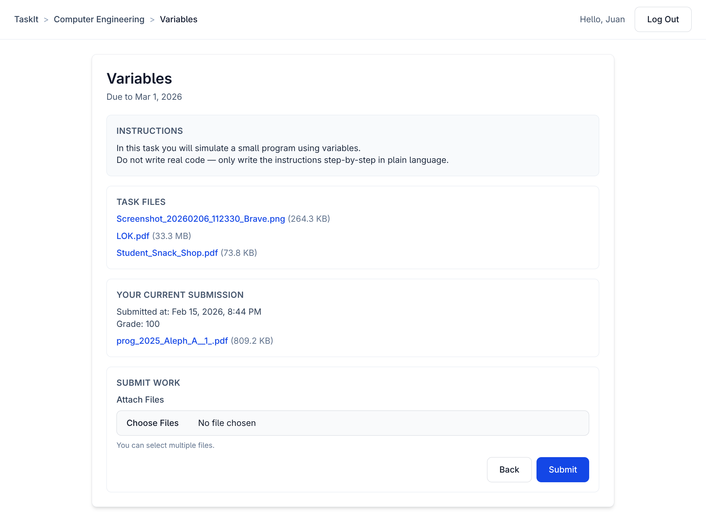

# TaskIt

TaskIt is a SvelteKit classroom workflow app with two roles:

- `teacher`: creates classrooms and tasks, enrolls students, reviews
  submissions, and grades.
- `student`: joins classrooms, views tasks, submits work, and tracks
  status/grades.

## Tech Stack

- SvelteKit 2 (Svelte 5 runes)
- Tailwind CSS 4 + Flowbite Svelte
- Drizzle ORM + better-sqlite3
- SQLite (`local.db`)

## Local Setup

```sh
pnpm install
pnpm dev
```

Useful scripts:

- `pnpm check` - Svelte + TypeScript checks
- `pnpm db:generate` - generate Drizzle migrations
- `pnpm db:migrate` - apply migrations
- `pnpm db:push` - push schema directly
- `pnpm db:studio` - open Drizzle Studio

## Authentication and Session Model

- Users can sign up and log in from `/`.
- Successful login/signup creates a server-side session row and cookie.
- Authenticated users are redirected by role:
  - teacher -> `/registered/teacher`
  - student -> `/registered/student`
- Logout is handled by `POST /registered/logout`.

## Page Guide (Purpose + Usage)

This section documents every current page route in `src/routes`.

### Public Pages

#### `/`

Purpose:

- Entry page for account creation and login.

Usage:

- Sign up with first name, last name, ID number, password, and role.
- Log in with ID number + password.
- On success, user is redirected to their role dashboard.



---

### Shared Registered Shell

All `/registered/*` pages render inside a shared layout:

- Breadcrumb trail (role-aware, classroom/task-aware)
- Greeting (`Hello, <firstName>`)
- Log out button

---

### Teacher Pages

#### `/registered/teacher`

Purpose:

- Teacher dashboard.

Usage:

- Update personal details (first name, last name, ID, phone).
- Create a classroom (`New Classroom`).
- Open any classroom (navigates to its tasks tab).
- Delete classroom via confirmation modal.



#### `/registered/teacher/classroom/[classroomId]/tasks`

Purpose:

- Manage tasks inside a classroom.

Usage:

- View tasks table: title, submission date, actions.
- Create a new task (`New Task`) -> redirects to
  `/registered/teacher/task-edit/[taskId]`.
- Edit task via `Edit`.
- Open task review via `Review`.
- Delete task via confirmation modal.



#### `/registered/teacher/classroom/[classroomId]/students`

Purpose:

- Manage classroom enrollment and view per-student task status.

Usage:

- Add student by ID number (modal form).
- Remove student (confirmation modal).
- View split table:
  - left: student identity (name, ID, phone)
  - right: one column per task showing status:
    - `not submitted`
    - `pending review`
    - numeric grade
- Task titles in the status header are links to task review pages.



#### `/registered/teacher/task-review/[taskId]`

Purpose:

- Review submissions for one task and assign grades.

Usage:

- Edit task title inline.
- View all classroom students for that task, including non-submitters.
- Per student row:
  - submitted timestamp (`Not submitted` when absent)
  - submitted files (`-` when absent)
  - grade input (only for submitted work)
- Save grade as integer `0..100`.



#### `/registered/teacher/edit-task/[taskId]`

Purpose:

- Edit task content and files.

Usage:

- Update title and instructions.
- Upload additional task files.
- Pick submission date with date picker (day-first display).
- Past dates are blocked in UI and rejected server-side.
- Save returns to classroom tasks page.



#### `/registered/teacher/task-edit/[taskId]`

Purpose:

- Alternate route for the same task-edit screen/logic.

Usage:

- Same behavior as `/registered/teacher/edit-task/[taskId]`.
- Exists because some flows still navigate here directly.


---

### Student Pages

#### `/registered/student`

Purpose:

- Student dashboard.

Usage:

- Update personal details (first name, last name, ID, phone).
- Join classroom by code (modal).
- Open classroom.
- Leave classroom (removes enrollment only, not classroom) via confirmation
  modal.


#### `/registered/student/classroom/[classroomId]`

Purpose:

- View tasks in one enrolled classroom.

Usage:

- See classroom name and task list.
- Open a task details/submission page.
- Per task status:
  - `Due to <date>` if not submitted
  - `submitted` if submitted but ungraded
  - numeric grade if graded



#### `/registered/student/task/[taskId]`

Purpose:

- View task details and submit/update work.

Usage:

- View title, due date, instructions, and task files.
- View current submission snapshot (timestamp, grade, submitted files).
- Upload submission files and submit.
- If a submission exists, submitting updates it (grade resets to ungraded).
- Requires at least one file in total (new or existing).



## Teacher Classroom Header Behavior

On teacher classroom pages (`.../tasks`, `.../students`), the shared classroom
header provides:

- Classroom name inline editing
- Classroom code modal (`View Code`)
- Tabs (`Tasks` / `Students`)
- Back button to teacher dashboard

## Non-Page Endpoints

- `POST /registered/logout` - deletes current session cookie + session record.
- `POST /registered/teacher/classroom/[classroomId]/rename` - updates classroom
  name and redirects back to the current classroom subpage.

## Data Model (High-Level)

Main tables:

- `users` (teacher/student profile and credentials)
- `sessions` (auth sessions)
- `classrooms` (owned by teacher)
- `enrollments` (student <-> classroom membership)
- `tasks` (belongs to classroom, has submission date)
- `task_files` (files attached to task)
- `submissions` (student work per task, optional grade)
- `submission_files` (files attached to submission)

Uploads are stored under:

- `static/uploads/tasks/<taskId>/...`
- `static/uploads/submissions/<submissionId>/...`
